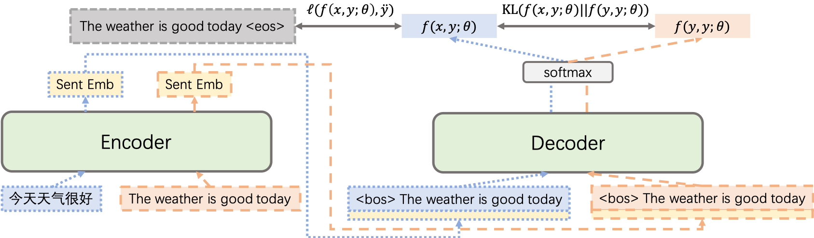

# Learning Multilingual Sentence Representations with Cross-lingual Consistency Regularization

This repository contains the PyTorch implementation (**Unofficial**) for our arXiv paper "[Learning Multilingual Sentence Representations with Cross-lingual Consistency Regularization](https://arxiv.org/abs/2306.06919)". Please check [here](./MuSR) for our pretrained MuSR model which supports 223 languages.



## Requirements and Installation

This work has been tested in the following environment.

* Python version == 3.7.0
* PyTorch version == 1.11.0
* Fairseq version == 0.12.2
* Faiss version == 1.6.3
* SentencePiece version == 0.1.99

## Reproduction

The following instructions can be used to train a Transformer model on three languages (English, French, and German) from Europarl v8 dataset.

### Preprocessing

Download and preprocess the data:

```
# Prepare the multilingual Europarl data
bash prepare-europarl.sh

# Preprocess/binarize the multilingual Europarl data
TEXT=europarl.tokenized
fairseq-preprocess --source-lang src --target-lang tgt \
    --trainpref $TEXT/train --validpref $TEXT/valid \
    --destdir data-bin/europarl.tokenized \
    --joined-dictionary --workers 20
```

### Training

Pretrain the Transformer multilingual translation model over the Europarl data:

```
EXP=europarl_baseline
DATA=data-bin/europarl.tokenized

mkdir -p checkpoint/$EXP
mkdir -p log/$EXP

CUDA_VISIBLE_DEVICES=0,1,2,3,4,5,6,7 fairseq-train $DATA \
    --user-dir ./user_src \
    --task translation --arch laser_transformer_768 \
    --max-source-positions 256 --max-target-positions 256 \
    --optimizer adam --adam-betas '(0.9, 0.98)' --clip-norm 5.0 \
    --lr-scheduler inverse_sqrt --warmup-init-lr 1e-07 --warmup-updates 10000 \
    --lr 0.0007 --stop-min-lr 1e-09 --dropout 0.1 \
    --criterion cross_entropy --weight-decay 0.0 \
    --max-tokens 4096 --fp16 --disable-validation --save-dir checkpoint/$EXP \
    1>log/$EXP/log.out 2>log/$EXP/log.err
```

Finetune the Transformer multilingual translation model over the Europarl data with CrossConST:

```
EXP=europarl_crossconst_alpha3
DATA=data-bin/europarl.tokenized
CKPT=checkpoint/europarl_baseline/checkpoint10.pt

mkdir -p checkpoint/$EXP
mkdir -p log/$EXP

CUDA_VISIBLE_DEVICES=0,1,2,3,4,5,6,7 fairseq-train $DATA \
    --user-dir ./user_src \
    --task translation --arch laser_transformer_768 \
    --max-source-positions 256 --max-target-positions 256 \
    --optimizer adam --adam-betas '(0.9, 0.98)' --clip-norm 5.0 \
    --lr-scheduler inverse_sqrt --warmup-init-lr 1e-07 --warmup-updates 10000 \
    --lr 0.0007 --stop-min-lr 1e-09 --dropout 0.1 \
    --criterion cross_entropy_with_crossconst --alpha 3.0 --weight-decay 0.0 \
    --reset-optimizer --reset-meters --reset-dataloader --reset-lr-scheduler --restore-file $CKPT \
    --max-tokens 4096 --fp16 --disable-validation --save-dir checkpoint/$EXP \
    1>log/$EXP/log.out 2>log/$EXP/log.err
```

### Evaluation

Evaluate our trained model on the German-English [BUCC 2018 Shared Task](https://comparable.limsi.fr/bucc2018/bucc2018-task.html) (as an example):

Download the German-English dataset (bucc2018-de-en.training-gold.tar.bz2) for the BUCC task.

```
# extract files with labels and texts from the BUCC corpus
tar -jxvf bucc2018-de-en.training-gold.tar.bz2

cd bucc2018/de-en/
cat de-en.training.en | cut -f1 > de-en.training.id.en
cat de-en.training.en | cut -f2 > de-en.training.txt.en
cat de-en.training.de | cut -f1 > de-en.training.id.de
cat de-en.training.de | cut -f2 > de-en.training.txt.de
cd ../../

BPE_CODE=europarl.tokenized/code
FILE_PREFIX=bucc2018/de-en/de-en.training

# apply sentencepiece model
python3 utils/spm_encode.py --model $BPE_CODE.model --output_format piece --inputs $FILE_PREFIX.txt.en --outputs $FILE_PREFIX.spm.en
python3 utils/spm_encode.py --model $BPE_CODE.model --output_format piece --inputs $FILE_PREFIX.txt.de --outputs $FILE_PREFIX.spm.de

# embed
CKPT=checkpoint/europarl_crossconst_alpha3/checkpoint10.pt
CUDA_VISIBLE_DEVICES=0 python3 emb.py --task de --lang en --checkpoint ${CKPT}
CUDA_VISIBLE_DEVICES=0 python3 emb.py --task de --lang de --checkpoint ${CKPT}

# mine for bitexts
CUDA_VISIBLE_DEVICES=0 python3 mine_bitexts.py $FILE_PREFIX.txt.de $FILE_PREFIX.txt.en \
    --src-lang de --trg-lang en --src-embeddings $FILE_PREFIX.emb.de.npy --trg-embeddings $FILE_PREFIX.emb.en.npy \
    --unify --mode mine --retrieval max --margin ratio -k 4 --verbose --gpu \
    --output $FILE_PREFIX.candidates.tsv \

# evaluate
python3 bucc.py --src-lang de --trg-lang en \
    --bucc-texts $FILE_PREFIX.txt --bucc-ids $FILE_PREFIX.id \
    --candidates $FILE_PREFIX.candidates.tsv --gold $FILE_PREFIX.gold --verbose
```

### Result

We evaluate the performance on the training dataset since the ground truth for the test dataset is not released.

P: Precision; R: Recall; F1: F1 score.

| Method | German-English | French-English |
| --- | --- | --- |
| Multilingual NMT Pretrain | P=81.49, R=58.53, F1=68.12 | P=77.97, R=55.43, F1=64.79 |
| &emsp; + CrossConST Finetune | P=95.39, R=95.20, F1=95.29 | P=92.94, R=92.75, F1=92.84 |


## Citation

If you find the resources in this repository helpful, please cite as:

```
@article{gao2023musr,
  title={Learning Multilingual Sentence Representations with Cross-lingual Consistency Regularization},
  author={Gao, Pengzhi and Zhang, Liwen and He, Zhongjun and Wu, Hua and Wang, Haifeng},
  journal={arXiv preprint arXiv:2306.06919},
  year={2023}
}
```
